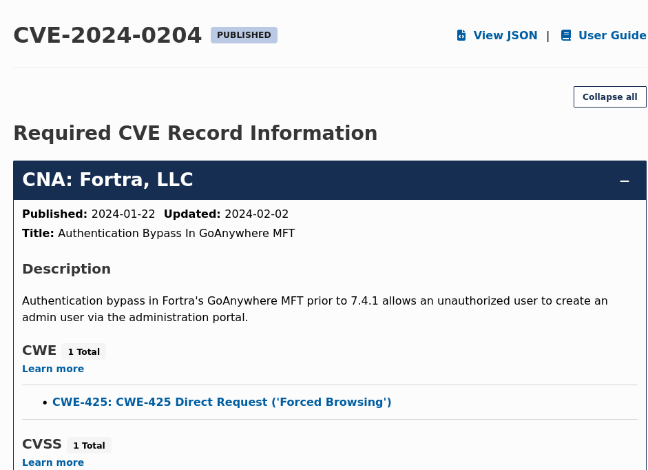
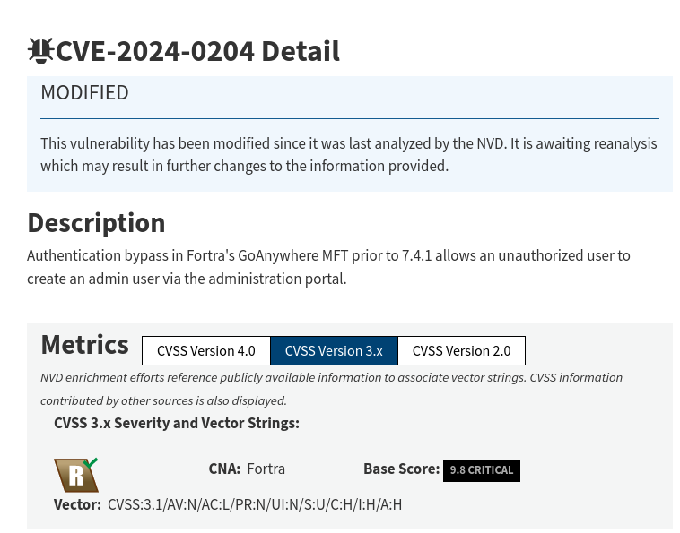
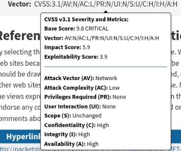
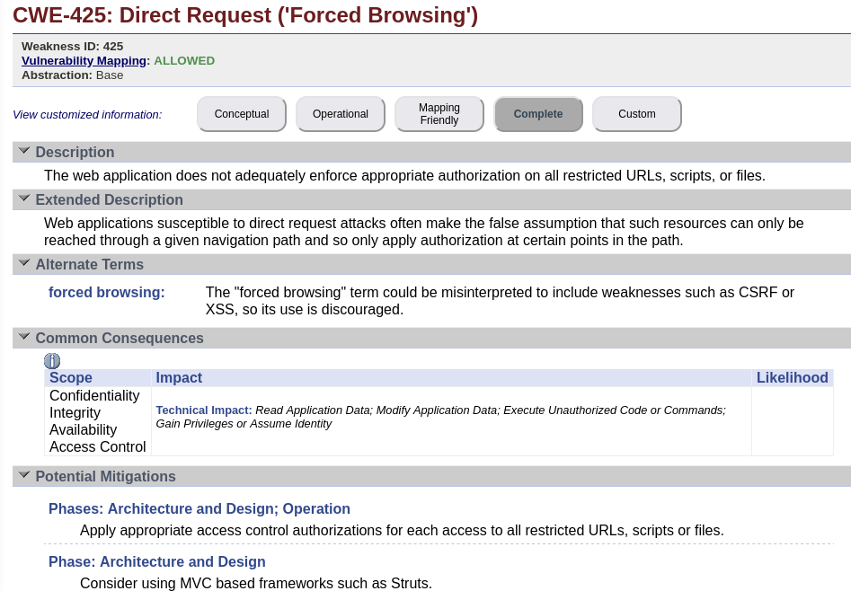
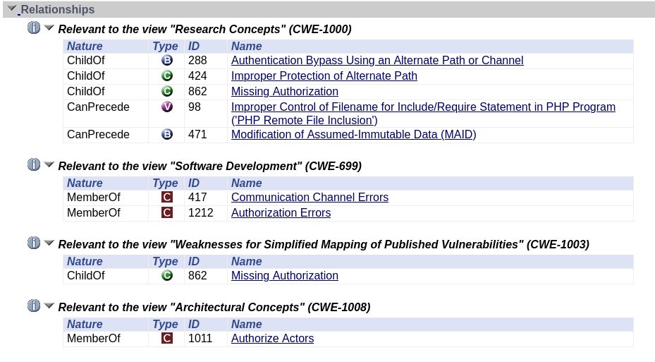
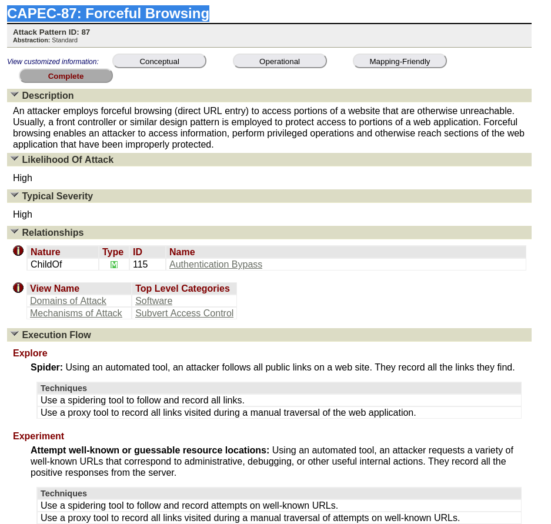
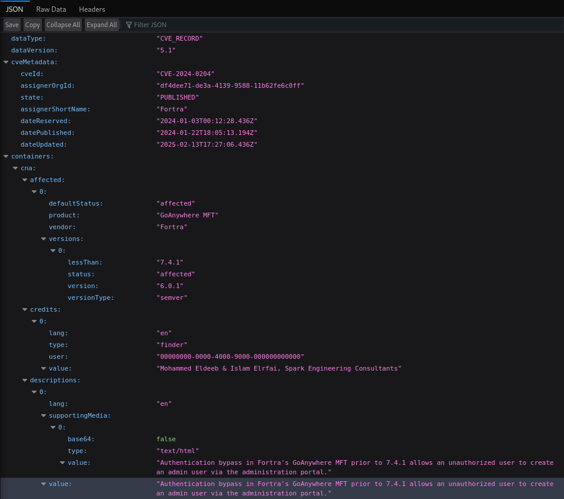
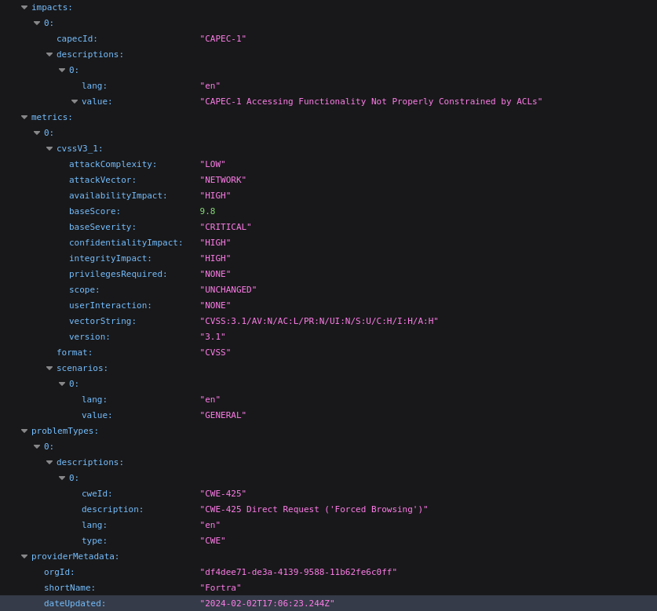
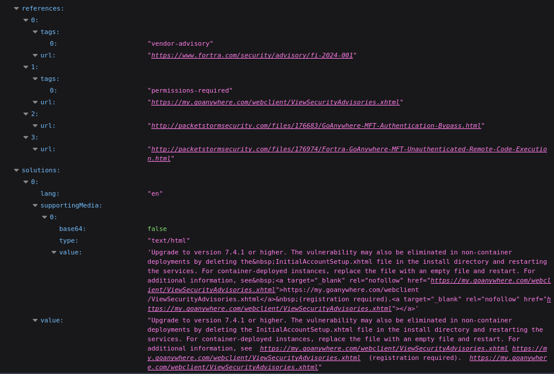
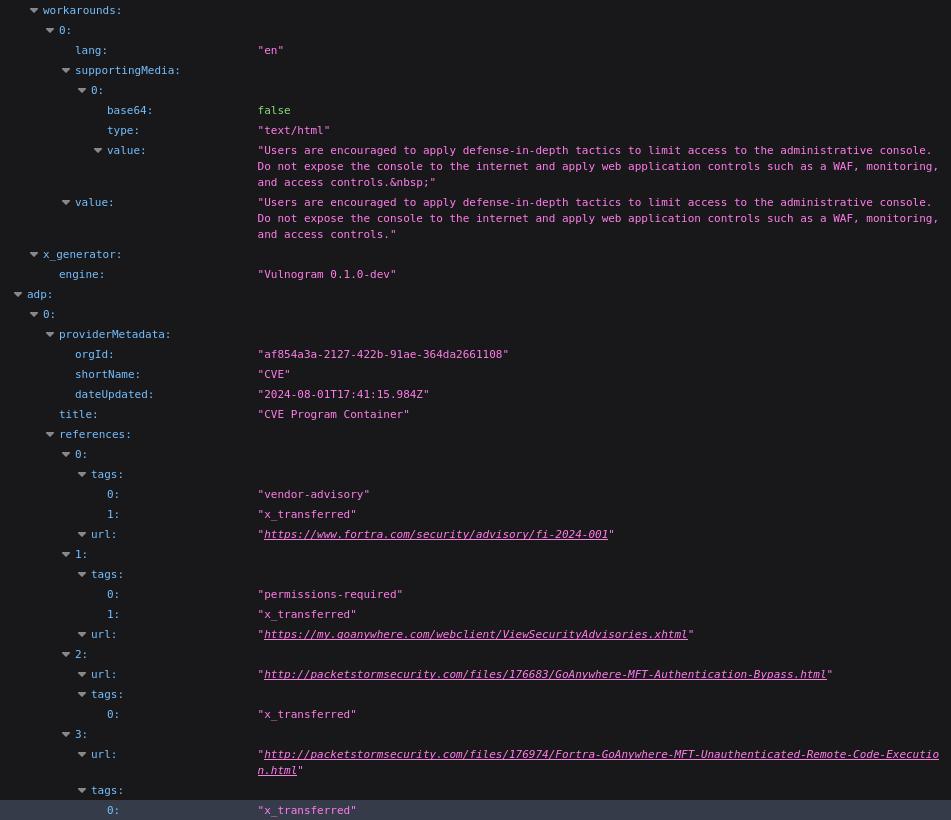

# PPS-Unidad2Actividad1-albertoVG
## Trazado de una vulnerabilidad.
Actividad 1 de la Unidad 1 de Puesta en Producción Segura. Tabajaremos con los Entornos de Desarrollo

Tenemos varios objetivos:

> [Conocer las diferentes listas que tienen que ver con amenazas de seguridad.](#Listas)

> [Obtener información de una vulnerabilidad navegando por las webs de los organismos que mantienen esas listas.](#Trazado)

---
## Listas

En [este enlace](https://moodle.educarex.es/ccff_iesvjp/pluginfile.php/27882/mod_resource/content/17/PresentacionUnidad2NivelesSeguridadAplicaciones2025.pdf) puedes ver la presentación donde se pueden encontrar información sobre las organizaciónes y agencias que mantienen información sobre amenazas, vulnerabilidades, debilidades etc.

Vemos que es grande la información en fuentes abiertas que podemos consultar. Aquí nos centraremos en obtener información principalmente de las siguientes listas:
- [Lista de vulnerabilidades comunes: CVE.](https://www.cve.org/)

- [Base de datos de vulnerabilidades: NVD.](https://www.nist.gov/)

- [Lista de debilidades comunes: CWE.](https://cwe.mitre.org/)

- [Lista de plataformas comunes: CPE.](https://cpe.mitre.org/)

- [Lista de patrones de ataque: CAPEC.](https://capec.mitre.org/)

También vamos a ver información de información adicional:

- [Ver el grado de criticidad de una vulnerabilidad y a partir de qué datos se calcula: CVSS.](https://www.first.org/cvss/)

[- [Ver el marco MITRE ATT&CK ](https://attack.mitre.org/)]:#

## Trazado

### Trazado de Vulnerabilidad: **CVE-2024-0204**

#### 1. **Identificación de la Vulnerabilidad**
- **CVE**: [CVE-2024-0204](https://cve.mitre.org/cgi-bin/cvename.cgi?name=CVE-2024-0204)
- **Descripción**: [Descripción detallada de la vulnerabilidad](https://cve.mitre.org/cgi-bin/cvename.cgi?name=CVE-2024-0204). Se especifica el tipo de vulnerabilidad, software afectado y los posibles vectores de ataque.

#### 2. **Evaluación de la Criticidad (CVSS)**
- **Puntaje CVSS**: [Consulta la puntuación CVSS en NVD](https://nvd.nist.gov/vuln/detail/CVE-2024-0204)

- **Descripción del CVSS**:
  - **Puntaje Total**: (ej. 9.8 / Crítica)
  - **Métricas de Explotabilidad**:
    - **Vector de ataque**: Red
    - **Complejidad de ataque**: Baja
    - **Privilegios necesarios**: Ninguno
    - **Interacción del usuario**: Ninguna
  - **Métricas de Impacto**:
    - **Confidencialidad**: Alta
    - **Integridad**: Alta
    - **Disponibilidad**: Alta
   

#### 3. **Debilidades Explotadas (CWE)**
- **CWE Asociados**:
  - **CWE-425**: Direct Request ('Forced Browsing')

 Entrando en la pagina que nos proporciona podemos ver mas información a cerca de este CWE
 

#### 4. **Patrones de Ataque Relacionados (CAPEC)**
- **Patrón de Ataque**: [CAPEC-87: Forceful Browsing](https://capec.mitre.org/data/definitions/87.html)
- **Descripción**: Este ataque explota la falta de restricciones adecuadas en la navegación dentro de una aplicación web. Un atacante puede manipular directamente las URL para acceder a recursos restringidos sin autenticación adecuada.
- **Impacto del Ataque**: 
  - **Confidencialidad**: Exposición de información confidencial almacenada en el servidor.
  - **Integridad**: Posibilidad de modificar datos sensibles si se combinan con otras vulnerabilidades.
  - **Disponibilidad**: En algunos casos, podría llevar a la denegación de servicio si el atacante explora repetidamente recursos restringidos.
 

#### 6. **Registro CVE**
Para descargar el registro del CVE tenemos que pulsar en la pagina de CVE.org en el boton que pone View JSON
Y se nos abrira los datos del CVE en un fichero de JSON, del cual voy a poner algunas capturas a continuación.

